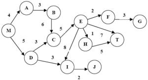
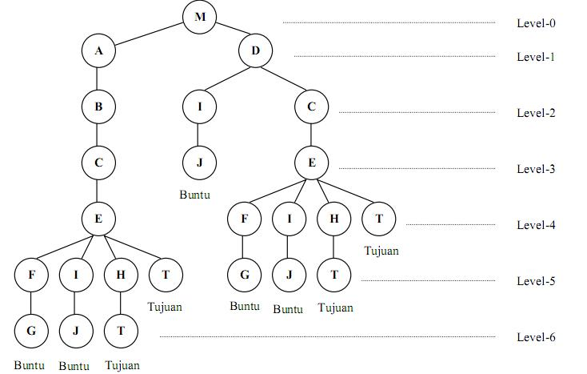
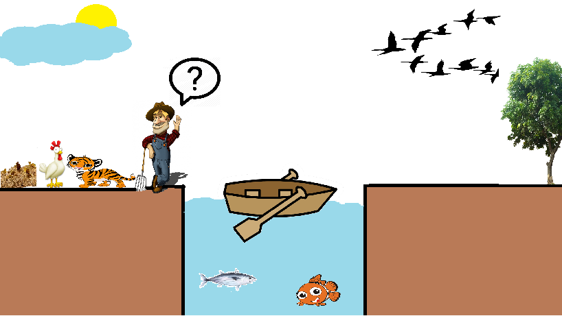
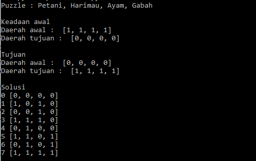

## Latar Belakang Masalah :
Pada kesempatan kali ini saya akan membahas tentang Ruang Keadaan,Cara Untuk Merepresentasikan Ruang Keadaan dan akan membuat contoh kasus Ruang Keadaan.

## Ruang Keadaan
Ruang keadaan adalah sebuah ruang berisi semua informasi yang diperlukan untuk memprediksi dampak dari suatu tindakan dan untuk menentukan apakah itu adalah ruang yang dituju. Sehingga secara umum, ada beberapa cara untuk merepresentasikan masalah yaitu :
* Mendefinisikan suatu ruang keadaan.
* Menetapkan satu atau lebih keadaan awal.
* Menetapkan satu atau lebih tujuan.
* Menetapkan kumpulan aturan.

## Cara Untuk Merepresentasikan Ruang Keadaan
1. Graph Keadaan

Graph keadaan terdiri dari node-node yang dihubungkan dengan arc (busur) yang diberi panah untuk menunjukkan arah keadaan awal dan keadaan baru yang akan dicapai berikutnya.

2. Pohon Pelacakan

Pohon pelacakan digunakan untuk menggambarkan keadaan secara hirarkis, sehingga mencegah node yang berulang.

## Contoh Kasus Ruang Keadaan
Contoh kasusnya adalah permasalahan petani, harimau, ayam, dan gabah. Petani ingin memindahkan dirinya sendiri, harimau, ayam, dan gabah menyebrangi sungai. Tapi perahunya hanya bisa membawa petani dan satu penumpang lainnya. Petani juga tidak bisa meninggalkan harimau dan ayam dalam satu tempat karena harimau akan memangsa ayam, dan petani juga tidak bisa meninggalkan ayam dengan gabah dalam satu tempat.

* Identifikasi ruang keadaan

Permasalahan ini dapat dilambangkan dengan: 
(Petani, Harimau, Ayam, Gabah) = (1,1,1,1)

* Keadaan awal

Daerah asal : (1,1,1,1) 
Daerah tujuan : (0,0,0,0)

* Tujuan

Daerah asal : (0,0,0,0) 
Daerah tujuan : (1,1,1,1)

* Aturan-aturan

Aturan ke- | Aturan
--------- | ---------
1 | Petani menyebrang
2 | Harimau menyebrang
3 | Ayam menyebrang
4 | Gabah menyebrang
5 | Petani kembali
6 | Harimau kembali
7 | Ayam kembali
8 | Gabah kembali

* Solusi

Daerah asal | Daerah tujuan | Aturan yang digunakan
--------- | --------- | ---------
(1,1,1,1) | (0,0,0,0) | 1,3
(0,1,0,1) | (1,0,1,0) | 5
(1,1,0,1) | (0,0,1,0) | 1,2
(0,0,0,1) | (1,1,1,0) | 5,7
(1,0,1,1) | (0,1,0,0) | 1,4
(0,0,1,0) | (1,1,0,1) | 5
(1,0,1,0) | (0,1,0,1) | 1,3
(0,0,0,0) | (1,1,1,1) | Solusi

Dibawah ini terdapat contoh hasil program solusi pemasalahan petani menyebrang sungai dengan menggunakan bahasa python.

## Kesimpulan
Jadi, reasoning adalah cara mempresentasikan fakta yang disajikan secara formal, semantic network adalah representasi yang mengepresikan solusi permasalahan dengan menggunakan graph berarah dan frame adalah representasi atau penyajian berorientasi objek.

## Saran
Diharapkan memahami materi dan tugas secara mendetail.
